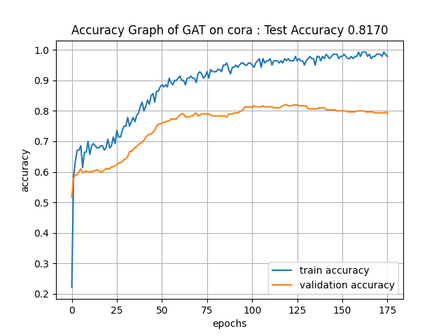
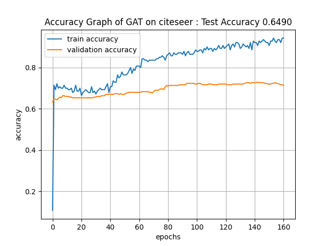
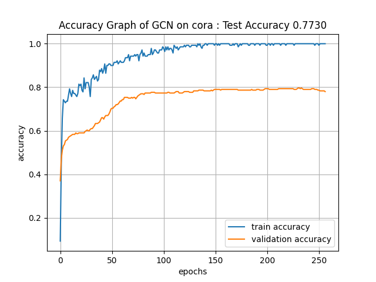
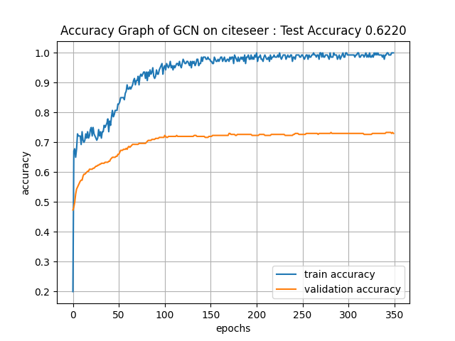
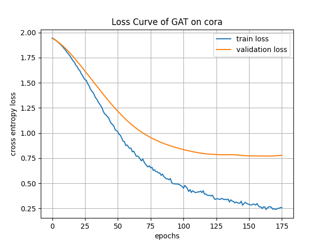
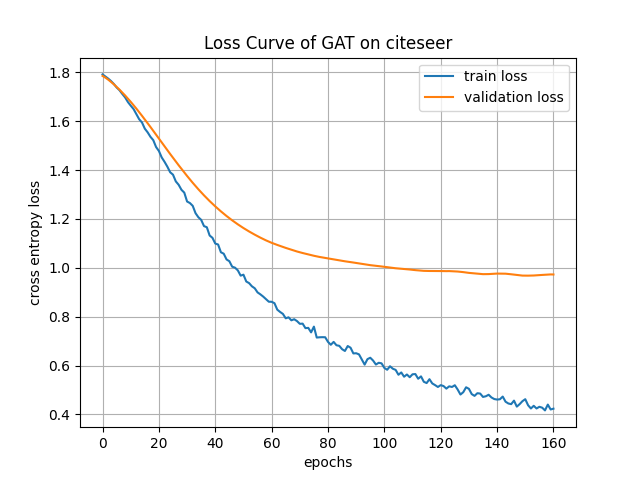
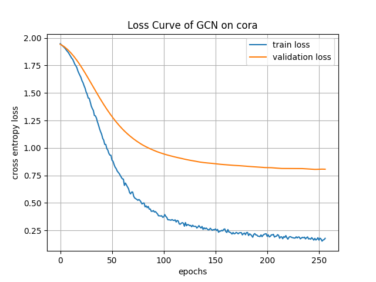
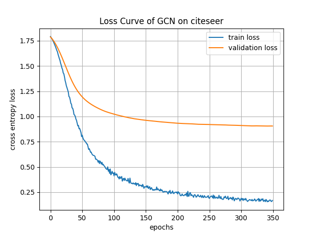

# GAT (Graph Attention Networks)
PyTorch implementation of the paper "Graph Attention Networks".

### Requirements
* Python 3.6 >
* PyTorch 1.4 >

### Results
* GCN : hidden node 64, GAT : hidden node 8, num head 8
* Accuracy on Cora (mean/high/low) : 0.8055/0.8170/0.7930 (GAT), 0.7659/0.7730/0.7530 (GCN)
* Accuracy on Citeseer (mean/high/low) : 0.6333/0.6490/0.6130 (GAT), 0.6161/0.6220/0.6080 (GCN)

### Accuracy Curves

### Loss Curves

### References
[1] Veličković, P., Cucurull, G., Casanova, A., Romero, A., Lio, P., & Bengio, Y. (2017). Graph attention networks. arXiv preprint arXiv:1710.10903.

[2] Kipf, T. N., & Welling, M. (2016). Semi-supervised classification with graph convolutional networks. arXiv preprint arXiv:1609.02907.
